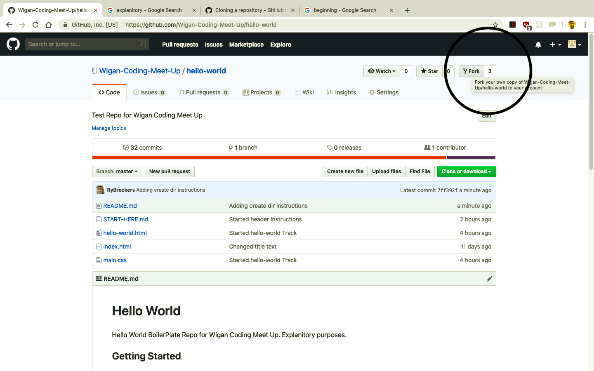

# Hello World

Hello World BoilerPlate Repo for Wigan Coding Meet Up. Explanitory purposes.

## Getting Started

Start by creating a new folder on your Desktop called <b>projects</b>

In your Terminal

```
cd Desktop, mkdir projects
```

 Fork and Clone this repo into your projects folder on your Desktop.
 Click the link and navigate to the "Fork" button toward's the top right of the screen. See img....

* [hello-world](https://github.com/Wigan-Coding-Meet-Up/hello-world.git)


 

 If you are un-aware how to Fork or Clone a repository at this point, then please read:

* [Fork A Repo](https://help.github.com/en/articles/fork-a-repo)
* [Cloning A Repository](https://help.github.com/en/articles/cloning-a-repository)


### Installing

In your terminal, navigate to the repository you have forked and cloned.

```
CD Desktop, CD projects, CD hello-world
```

Then open the Index.html page in the browser.

```
open index.html
```

For Windows users.

```
start index.html
```

You should now see a blank page in the browser with a welcome message.

## Built With

* [HTML5](https://developer.mozilla.org/en-US/docs/Web/Guide/HTML/HTML5) 
* [CSS3](https://developer.mozilla.org/en-US/docs/Web/CSS/CSS3) 

## Authors

* **Ryan Brockley** - projects - [GitHub](https://github.com/RyBrockers)

