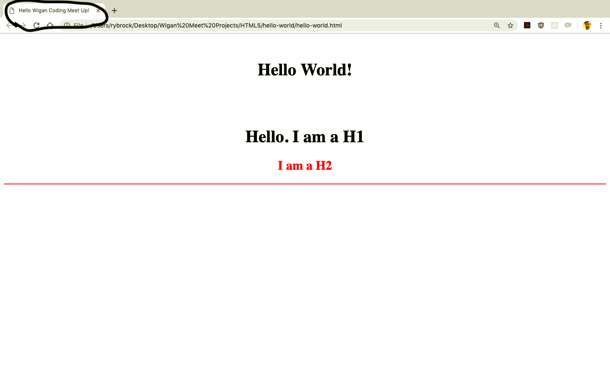

# Welcome to HTML5 hello-world.  :computer:

In this section we will learn about the different types of HTML tags/elements, why we would use them and when?

There are many different types of tags/elements in HTML5 and they are one and the same.

Tags/elements in HTML are the building blocks of any website or application.

___

### HTML stands for   :arrow_down:
```
Hyper Text Mark-Up Language
```

* You can read and research the history of HTML and it's previous versions here:

:x: [A breif history of html](https://www.wired.com/1997/04/a-brief-history-of-html/)

If we think of HTML5 being the skeleton of our website then we would not be far away with our presumption.
All HTML5 pages are called <b>"Documents"</b> and are the building blocks for any website or application. HTML <b>"Documents"</b> are usually written <b>"Semantically"</b> which means each element has a specific use case for its purpose.

* Read more about Semantic HTML here:

:x: [Semantic HTML](https://developer.mozilla.org/en-US/docs/Glossary/Semantics#Semantics_in_HTML)

### Here are some more commonly used HTML5 Elements.   :heavy_exclamation_mark:

#### Remember!
Some elements in HTML are styled differently. This means some of them display "In-Line" and some of them display as "Block". We will get to what both these display styles mean when we start <b>CSS3</b>.

## The &#60;head&#62; element   :arrow_down:
The &#60;head&#62; element is used to define the <b>meta data</b> in our HTML document. It looks like this:

&#60;head&#62; &#60;/head&#62;

This element goes above the &#60;body&#62; element and contains language information and font type information. This allows our browser to read and display content accordingly.

### Typical use case

```
<head>

<title>Hello Wigan Coding Meet-Up!</title>

 </head>
 
 ```

* More information on <b>meta data</b> can be found here:


:x: [HTML Meta Data](https://developer.mozilla.org/en-US/docs/Learn/HTML/Introduction_to_HTML/The_head_metadata_in_HTML)


* Read more about the &#60;head&#62; &#60;/head&#62; element here:

:x: [HTML Head Element](https://developer.mozilla.org/en-US/docs/Web/HTML/Element/head)

___

## The &#60;title&#62; element   :arrow_down:
The &#60;title&#62; element is used to define the <b>Title</b> in our HTML document. It looks like this:

&#60;title&#62; &#60;/title&#62;

This element goes inside the &#60;head&#62; element and contains the title of our webpage/website. This allows our browser to read and display content accordingly.

### Typical use case

```
<head>

<title>Hello Wigan Coding Meet-Up!</title>

 </head>
 
 ```

 This will display the title of the Website in the browsers tab! 

 ### Check here for screenshots and help

 
___

* More information on <b>meta data</b> can be found here:


:x: [HTML Meta Data](https://developer.mozilla.org/en-US/docs/Learn/HTML/Introduction_to_HTML/The_head_metadata_in_HTML)


* Read more about the &#60;head&#62; &#60;/head&#62; element here:

:x: [HTML Head Element](https://developer.mozilla.org/en-US/docs/Web/HTML/Element/head)

___

## The &#60;body&#62; element   :arrow_down:
The &#60;body&#62; element is used to define the <b>main</b> content in HTML document. It looks like this:

&#60;body&#62; &#60;/body&#62;

In most cases, all other elements will go inside the body tags.
Notice how we have an opening &#60;body&#62; and a closing &#60;/body&#62; tags. Most elements in HTML require opening and closing tag. The difference if you look closely, is a /.
There are elements that don't require a closing tag, we will get to those later!

* Read more about the &#60;body&#62; &#60;/body&#62; element here:

:x: [HTML Body Element](https://developer.mozilla.org/en-US/docs/Web/HTML/Element/body)


___

## The &#60;h&#62; element   :arrow_down:
The &#60;h&#62; element is used to define a <b>Header</b> in HTML. It looks like this:

&#60;h1&#62;&#60;/h1&#62;

The <b>Header</b> elementopen he   is a very descriptive tag. There are 6 header tags in total. They range from &#60;h1&#62; to a &#60;h6&#62;. The size of the text get's smaller the higher the h number goes. So a &#60;h1&#62; tag is the largest font-size and the &#60;h6&#62; tag has the smallest font-size.

* Read more about the H elements here:

:x: [HTML H Elements (Header)](https://developer.mozilla.org/en-US/docs/Web/HTML/Element/Heading_Elements)

___

## The &#60;p&#62; element   :arrow_down:
The &#60;p&#62; element is used to define a <b>Paragraph</b> in HTML. It looks like this:

&#60;p&#62;&#60;/p&#62;

Notice how we have an opening &#60;p&#62; and a closing &#60;/p&#62; tags. Most elements in HTML require opening and closing tags. The difference if you look closely, is a /.
There are elements that don't require a closing tag, we will get to those later!

* Read more about 

___


